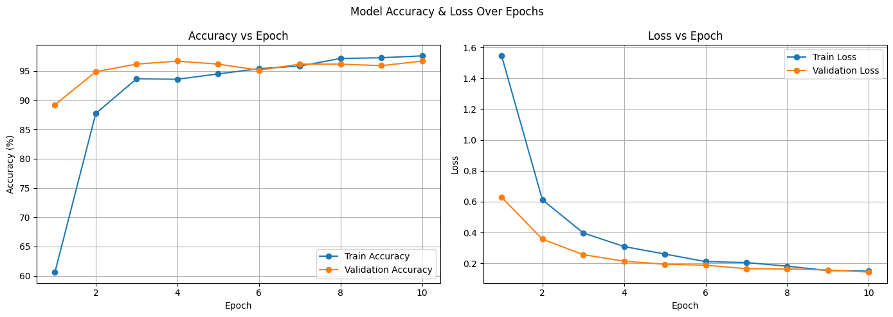

# 🐾 Animal Classification using Deep Learning (ResNet-18)

This project implements a deep learning model to classify **15 types of animals** based on their images using transfer learning with **ResNet-18**.

---

## 📁 Project Structure

```
Animal-Classification/
|
├── animal_classification.ipynb     # Main Jupyter notebook for training & inference
├── requirements.txt                # List of required Python libraries
├── dog.jpeg                        # Sample image for prediction
├── dataset/                        # Folder containing training images (train/animal_name/xxx.jpg)
├── Image Classification of animals.pdf # Detailed project report
└── README.md                       # This file
```

---

## 🎯 Problem Statement

Classify animal images into 15 predefined classes using a deep learning model. This is a classic **Image Classification** problem under **Computer Vision**.

---

## 🧠 Model Overview

- ✅ **Pretrained Model**: ResNet-18
- 🔄 **Transfer Learning**: Last layer modified for our 15 classes
- 📊 **Accuracy Achieved**: ~97%

---

## 📦 Dataset

- 📁 Location: `dataset/train`
- 🖼️ Total Images: `1944`
- 🐾 Classes:
  ```
  ['Bear', 'Bird', 'Cat', 'Cow', 'Deer', 'Dog', 'Dolphin', 'Elephant', 
   'Giraffe', 'Horse', 'Kangaroo', 'Lion', 'Panda', 'Tiger', 'Zebra']
  ```

---

## 🔍 Class Distribution

Each class has approx. 120–135 images:

Example:
```
Dog: 122 images
Cat: 123 images
Zebra: 137 images
...etc
```

---

## 🔧 Preprocessing Steps

- Resize images to `224x224`
- Normalize using ImageNet mean & std
- Torch `transforms.Compose` applied

---

## 🔀 Dataset Split

- **Training**: 80% → `1555` images
- **Validation**: 20% → `389` images
- Visualized using matplotlib (bar chart)

---

## 🚀 Model Architecture

- **Base**: `ResNet-18` from `torchvision.models`
- **Layers Frozen**: All except the final fully connected layer
- **Final Layer**: `nn.Linear` adapted to 15 output classes

---

## ⚙️ Training Details

- 🔢 Epochs: `10`
- 📉 Loss Function: `CrossEntropyLoss`
- ⚙️ Optimizer: `Adam (lr=0.001)`
- 📊 Metrics Tracked: Accuracy, Loss (per epoch)
- 🔁 Batch Size: `16`

---

## 📈 Performance

- 🏋️ Final Train Accuracy: **~97.5%**
- 🧪 Final Validation Accuracy: **~96.66%**

### 🔁 Training Curve
- Accuracy vs Epoch
- Loss vs Epoch



---

## 📊 Evaluation Metrics

- **Precision, Recall, F1-Score** using `classification_report`
- **Confusion Matrix** using `sklearn`
- Per-class metrics for all 15 categories

> Example class report:
```
Dog: Precision=0.93, Recall=1.00, F1-score=0.96
Elephant: Precision=1.00, Recall=1.00, F1-score=1.00
```

---

## 🔎 Sample Prediction

- ✅ Predicts custom image `dog.jpeg`
- Displays image and predicted label using `matplotlib`

---

## 💾 Saving Model

Model saved as:
```bash
torch.save(model.state_dict(), "animal_classifier_resnet18.pth")
```

Can be loaded later for inference.

---

## 📄 PDF Report

📌 [**Image Classification of animals.pdf**](./Image%20Classification%20of%20animals.pdf) – contains detailed steps, methodology, and visualizations.

---

## 📚 Libraries Used

```bash
Python >= 3.7

- torch
- torchvision
- numpy
- matplotlib
- sklearn
- PIL
```

Install all at once:
```bash
pip install -r requirements.txt
```

---

## ▶️ How to Run

1. Clone the repo:
```bash
git clone https://github.com/shivanshu-1609/Animal-Classification.git
```
2. Move into project folder:
```bash
cd Animal-Classification
```
3. Install dependencies:
```bash
pip install -r requirements.txt
```
4. Run Jupyter Notebook:
```bash
jupyter notebook animal_classification.ipynb
```

---

## 🚧 Future Improvements

- Add more animal species
- Train using Convolutional Neural Networks (CNNs) from scratch
- Deploy using Flask, Streamlit, or FastAPI
- Add web or mobile UI for predictions

---

## 🙋‍♂️ Author

👨‍💻 **Shivanshu Shukla**  
BTech | AI & ML Enthusiast  
GitHub: [@shivanshu-1609](https://github.com/shivanshu-1609)

---

## 🌐 Connect

If you liked the project, leave a ⭐ on the repo!  
Feel free to connect with me on [LinkedIn](https://linkedin.com/in/shivanshu-shukla16/) for feedback, collaborations, or queries.

---
